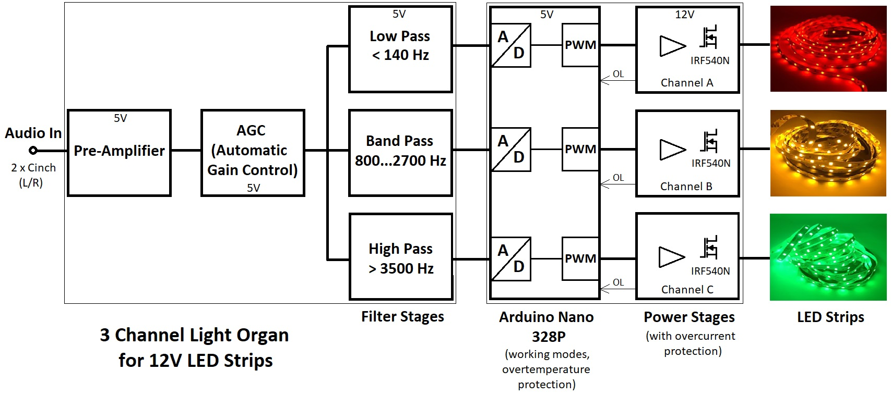

# LED-Strip Light Organ #

A light (or color) organ is an electronic device which converts an audio signal into rhythmic light effects. Invented in the 70's they are still popular in discotheques and party rooms though.
Now that **LED strips** became fairly cheap they can replace normal light bulbs used in the earlier years and make the color organ look more modern.

The electronic circuit of a normal light organ separates the audio signal into several frequency bands and dimms the light bulbs or LEDs according to the average level of each band.

For a decent visual impression at least 3 bands (channels) are needed: low frequencies (bass), middle frequencies and high frequencies (treble). For best visual results each channel should control a light source of different color, e.g bass = red, middle = yellow and treble = green.

In our case we control 3 LED strips that are specified for 12V DC. Since different LED strips vary in their electrical parameters, their respective current ratings and the external 12V power supply you use determine the maximum length of the LED Strips the device can handle.

The LED Strips I have tested with are equipped with 3528 SMD LEDs, have 60 LEDs per meter length and are 5m long. They proved no problems at all and never triggered the electric overload circuitry.

The light organ has 3 working modes: [Normal](https://github.com/yellobyte/LED-Strip-Light-Organ/blob/main/Doc/NormalMode.mp4), [Rhythm](https://github.com/yellobyte/LED-Strip-Light-Organ/blob/main/Doc/RhythmMode.mp4) and [Cyclic](https://github.com/yellobyte/LED-Strip-Light-Organ/blob/main/Doc/Cyclic.mp4), which can be selected via pressing the **mode selection** button.

## Technical infos ##

For calculating the values of the 3 filter circuits the program **FilterLab** was used. It's easy and very intuitive. An Arduino Nano 328P samples the respective filter output und transforms the voltage level into digital PWM signals which feed the PAs with their IRF540N Power MOSFETs. Overtemperature & electric overload (OL) protection has been integrated. 

The circuit had to be devided into 2 separate PCBs, a **Filter-PCB** and a **Power-PCB** as I only call the basic version of the Eagle Design Tool my own and therefore PCB size is limited to Euro card size. But this proved to be very fortunate in the end for I tried several different PA designs and didn't have to redo the analog stages every time. Please have a look at folder [**EagleFiles**](https://github.com/yellobyte/LED-Strip-Light-Organ/blob/main/EagleFiles) for schematic & PCB details.

The block diagram of the light organ is as follows:

Remarks to the **Filter-PCB**:

The MC33078 op amps proved to be perfect for the task but might be substituted with cheaper op amps, e.g. TL082, TLC277 or MC1458 but this comes with a loss of signal quality (distortion!). Especially the MC1458 wasn't able to pull the signal fully down to the lower rail. The TLC277 showed some crossover distortion.

The cheap LM358 op amp used in the filter stages generates crossover distortion as well but this is of no consequence in that particular application.

The AGC stage is simple but very effective and doesn't produce hardly any distortion even with high input signals applied. This stage is needed in order to normalize the signal level fed into the filter stages as the signal level from the many audio sources can vary by an order of magnitude (mp3 file, CD, vinyl player, internet radio, etc.).

Remarks to the **Power-PCB**:

The Arduino Nano 328P is the ideal device for sampling the three filter outputs and generating PWM signals needed by the power stages. It runs on 16MHz only but this proved to be fast enough for the task.

The code running on the Arduino Nano is available in folder [Software](https://github.com/yellobyte/LED-Strip-Light-Organ/Software). The IDE used was VSCode/PlatformIO.

The Power MOSFET IRF540N need a gate voltage higher than TTL can provide in this application so 12V DC-DC converters had to be used. There output is kind of floating as can be seen in the schematic.

Shunt resistors (R6/R12/R18) are used between the MOSFETs and the LED strips in order to measure the output current and allow to utilize the current sense input of the MOSFET drivers IR2125. When the IR2125 detects over current it shuts down immediately until the next PWM impuls. The software in the Arduino Nano detects this condition and shuts down the affected channel for a few seconds before releasing it again. No harm is done at all in case you have a permanent shortage on the output lines!

The power stages by design could deliver a few amperes per channel, but in my case the external 12V power supply at hand (Mean Well GS90A12) can only deliver 6.7A DC, so I calibrated the current limit to about 2.2A per channel using trimpots (trimmer potentiometer R7/R13/R19). The driver MOSFETs IRF540N operate way from their absolute maximum ratings and only get handwarm in the enclosure (Model EXN-23361-SV from Bud Industries).

A temperature sensor LM35DZ is used to measure the temperature inside the enclosure. Temperatures over 50° celsius will shut down all channels and temperatures below 40° celsius will release it again. During my hour long tests the temperature overload never got triggered.

JP1/JP2/JP3 are only needed for testing purposes, in normal working mode pins 1&2 should be shorted in order to allow the overload signal from the IR2125 reach the Arduino Nano. R2/SV3 are only used for testing purposes as well.

Push button S1 is only used for selecting the working mode.

The three TVS Diodes P6KE20A (D5/D9/D13) have a very fast response time and protect the device from voltage transients that might travel in from connected LED strips. The latter act like big antennas when a few meters long!

D1 provides the reference voltage needed by the A/D converters in the Arduino Nano.

## How to calibrate the circuit ##

On the **Filter-PCB** the pre-amplifier stage, the automatic gain control (AGC) stage and all three filter circuits have to be calibrated in order to produce optimal results. The procedure itself is fairly easy. Only obstacle is you need a function generator and ideally an oscilloscope. A cheap multimeter will do if you can´t get hold of the latter.

Necessary steps in correct order:

1) Adjust the trimpot R8 so that pins 1 & 2 of R8 are shorted (AGC is inactive that way). Apply a signal of 1kHz/0.5Vpp to X5 **or** X6 on the power board (one of the two Cinch/RCA sockets). It gets forwarded to LSP7 on the filter board (inverting input of pre-amplifier op amp IC1A). 

2) Choose a value of R12 so that the signal level at LSP2 (output of op amp IC1B) is close to 2.70Vpp. In my case I ended up with a R12 of 470k.

3) Increase the amplitude of the input signal to 2.0Vpp. Now adjust the trimpot R8 so that the signal level at LSP2 is close to 3.2Vpp.

At this point the pre-amplifier & AGC stages are properly calibrated. The filter stages follow:

4) Change the input signal to 50Hz/0.7Vpp and adjust R17 so that you get 3.6Vpp at LSP4.

5) Change the input signal to 1.3kHz/0.7Vpp and adjust R22 so that you get 3.6Vpp at LSP5.

6) Change the input signal to 6kHz/0.7Vpp and adjust R30 so that you get 3.6Vpp at LSP6.

That's it. The analog circuit on the **Filter-PCB** is now fully calibrated.

On the **Power-PCB** only the current limits of each channel (A/B/C) need to be calibrated. That's a bit tricky as you need a current running through the MOSFETs that has exactly the value you want the IR2125 to trigger at. I used a cheap electronic load from Aliexpress (XY-FZ35) to accomplish that. 

Before you start make sure the Arduino Nano is REMOVED from the Power-PCB, your external power supply is NOT attached to the 12V power socket and there are NO jumpers on JP1/JP2/JP3 !

The following steps have to be done for each channel A/B/C:

7) Adjust the trimpots R7/R13/R19 so that U1/U2/U3 pins 5 & 6 (CS & VS of IR2125) are shorted
8) Attach a voltmeter to LSP12/LSP22/LSP32 and Ground
9) Attach the electronic load to the channel output socket (the socket for the LED-strip) and set the current limit to the desired trigger value 
10) Connect A/B/C-OUT (IR2125 pin 2) with LSP2 (+12V=). That will switch the MOSFET on at the next step.
11) Now connect the external 12V power supply, the load should see the set current flow
12) Turn the screw on the trimpots R7/R13/R19 so that the voltage on LSP12/LSP22/LSP32 just jumps from 0 to 4.7V. Don't turn any further but stop immediately!
13) Remove the external 12V power supply and the electronic load 
14) Put a jumper on pins 1 & 2 of JP1/JP2/JP3 and remove the connection between LSP2 and A/B/C-OUT
15) proceed with the next channel

Having all channels calibrated you can put the Arduino Nano back onto the board.
Those settings done for all channels, even a short on the output sockets won't destroy your output stages.
